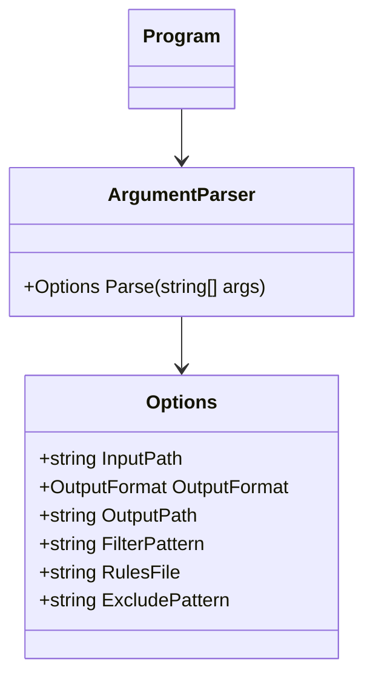
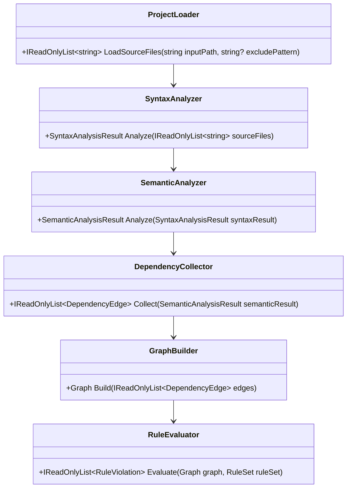
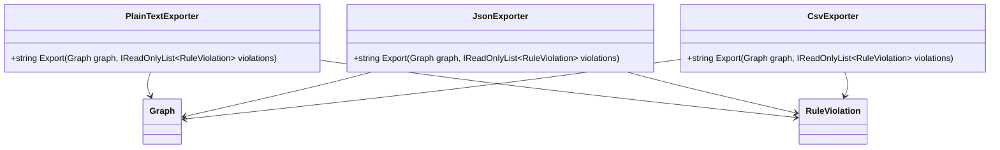
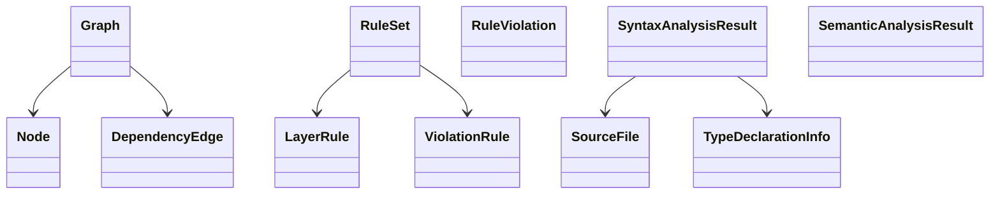

# クラス図

```mermaid
classDiagram
    class Program

    class Options {
        +string InputPath
        +OutputFormat OutputFormat
        +string OutputPath
        +string FilterPattern
        +string RulesFile
        +string ExcludePattern
    }

    class ArgumentParser {
        +Options Parse(string[] args)
    }

    class ProjectLoader {
        +IReadOnlyList~string~ LoadSourceFiles(string inputPath, string? excludePattern)
    }

    class SyntaxAnalyzer {
        +SyntaxAnalysisResult Analyze(IReadOnlyList~string~ sourceFiles)
    }

    class SemanticAnalyzer {
        +SemanticAnalysisResult Analyze(SyntaxAnalysisResult syntaxResult)
    }

    class DependencyCollector {
        +IReadOnlyList~DependencyEdge~ Collect(SemanticAnalysisResult semanticResult)
    }

    class GraphBuilder {
        +Graph Build(IReadOnlyList~DependencyEdge~ edges)
    }

    class RuleEvaluator {
        +IReadOnlyList~RuleViolation~ Evaluate(Graph graph, RuleSet ruleSet)
    }

    class PlainTextExporter {
        +string Export(Graph graph, IReadOnlyList~RuleViolation~ violations)
    }

    class JsonExporter {
        +string Export(Graph graph, IReadOnlyList~RuleViolation~ violations)
    }

    class CsvExporter {
        +string Export(Graph graph, IReadOnlyList~RuleViolation~ violations)
    }

    class Node
    class DependencyEdge
    class Graph
    class RuleSet
    class LayerRule
    class ViolationRule
    class RuleViolation
    class SyntaxAnalysisResult
    class SourceFile
    class TypeDeclarationInfo
    class SemanticAnalysisResult

    Program --> ArgumentParser
    Program --> ProjectLoader
    Program --> SyntaxAnalyzer
    Program --> SemanticAnalyzer
    Program --> DependencyCollector
    Program --> GraphBuilder
    Program --> RuleEvaluator
    Program --> PlainTextExporter
    Program --> JsonExporter
    Program --> CsvExporter

    ArgumentParser --> Options

    SyntaxAnalyzer --> SyntaxAnalysisResult
    SyntaxAnalysisResult --> SourceFile
    SyntaxAnalysisResult --> TypeDeclarationInfo

    SemanticAnalyzer --> SemanticAnalysisResult

    DependencyCollector --> DependencyEdge
    DependencyCollector --> Node

    GraphBuilder --> Graph
    Graph --> Node
    Graph --> DependencyEdge

    RuleEvaluator --> RuleSet
    RuleSet --> LayerRule
    RuleSet --> ViolationRule
    RuleEvaluator --> RuleViolation

    PlainTextExporter --> Graph
    JsonExporter --> Graph
    CsvExporter --> Graph
```

## CLI レイヤ

```mermaid
classDiagram
    class Program
    class ArgumentParser {
        +Options Parse(string[] args)
    }
    class Options {
        +string InputPath
        +OutputFormat OutputFormat
        +string OutputPath
        +string FilterPattern
        +string RulesFile
        +string ExcludePattern
    }

    Program --> ArgumentParser
    ArgumentParser --> Options
```

## 解析パイプライン レイヤ

```mermaid
classDiagram
    class ProjectLoader {
        +IReadOnlyList~string~ LoadSourceFiles(string inputPath, string? excludePattern)
    }
    class SyntaxAnalyzer {
        +SyntaxAnalysisResult Analyze(IReadOnlyList~string~ sourceFiles)
    }
    class SemanticAnalyzer {
        +SemanticAnalysisResult Analyze(SyntaxAnalysisResult syntaxResult)
    }
    class DependencyCollector {
        +IReadOnlyList~DependencyEdge~ Collect(SemanticAnalysisResult semanticResult)
    }
    class GraphBuilder {
        +Graph Build(IReadOnlyList~DependencyEdge~ edges)
    }
    class RuleEvaluator {
        +IReadOnlyList~RuleViolation~ Evaluate(Graph graph, RuleSet ruleSet)
    }

    ProjectLoader --> SyntaxAnalyzer
    SyntaxAnalyzer --> SemanticAnalyzer
    SemanticAnalyzer --> DependencyCollector
    DependencyCollector --> GraphBuilder
    GraphBuilder --> RuleEvaluator
```

## Exporter レイヤ

```mermaid
classDiagram
    class PlainTextExporter {
        +string Export(Graph graph, IReadOnlyList~RuleViolation~ violations)
    }
    class JsonExporter {
        +string Export(Graph graph, IReadOnlyList~RuleViolation~ violations)
    }
    class CsvExporter {
        +string Export(Graph graph, IReadOnlyList~RuleViolation~ violations)
    }
    class Graph
    class RuleViolation

    PlainTextExporter --> Graph
    PlainTextExporter --> RuleViolation
    JsonExporter --> Graph
    JsonExporter --> RuleViolation
    CsvExporter --> Graph
    CsvExporter --> RuleViolation
```

## Models レイヤ

```mermaid
classDiagram
    class Node
    class DependencyEdge
    class Graph
    class RuleSet
    class LayerRule
    class ViolationRule
    class RuleViolation
    class SyntaxAnalysisResult
    class SourceFile
    class TypeDeclarationInfo
    class SemanticAnalysisResult

    Graph --> Node
    Graph --> DependencyEdge
    RuleSet --> LayerRule
    RuleSet --> ViolationRule
    SyntaxAnalysisResult --> SourceFile
    SyntaxAnalysisResult --> TypeDeclarationInfo
```
