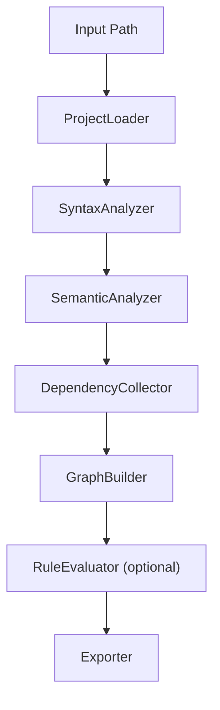
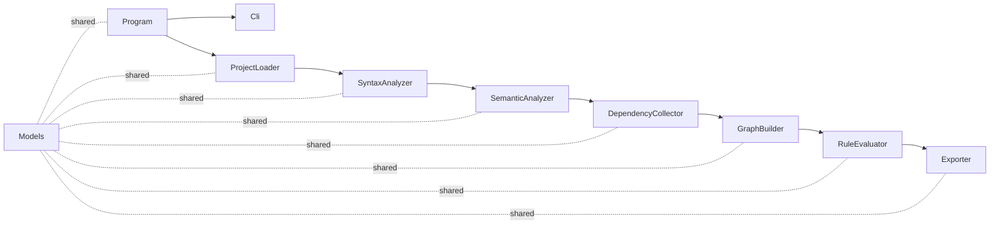

# 詳細設計 (Low-Level Design)

## 1. コンセプト
このツールは「.NET/C# の依存構造を CLI で短時間に把握できる」ことを目的に、
静的解析（Roslyn）で正確な依存関係を抽出し、Plain/DOT で可視化する。

## 2. アーキテクチャ概要
単一責務のパイプライン構成で、入力から出力までを直列に処理する。
各ステップは独立しており、将来の機能追加（SVG/PNG 変換、ルール拡張）に対応しやすい。

### 2.1 パイプライン構成


### 2.2 依存方向
- 上流のコンポーネントは下流の詳細を知らない
- データモデルは `Models` に集約し、各コンポーネントはモデルだけを共有

## 3. 主要コンポーネント

### ProjectLoader
- 役割: `.csproj` またはフォルダから `.cs` ファイル一覧を解決
- 出力: 解析対象ファイルのパス一覧

### SyntaxAnalyzer
- 役割: 構文木生成と型宣言の抽出
- 出力: `SyntaxTree` と型宣言メタ情報

### SemanticAnalyzer
- 役割: Roslyn の `SemanticModel` で型解決
- 出力: 型/シンボル情報

### DependencyCollector
- 役割: 依存抽出（継承/実装/型参照/メソッドシグネチャ/new）
- 出力: `DependencyEdge` の集合

### GraphBuilder
- 役割: ノード/エッジの構築と循環検出
- 出力: `Graph`

### RuleEvaluator
- 役割: ルールファイルの適用と違反判定
- 出力: `RuleViolation` の一覧

### Exporter
- 役割: 依存情報の出力（Plain/DOT）
- 出力: 文字列

## 4. データモデル

### Node
- `Id`: 一意識別子（例: `Namespace.Type`）
- `Name`: 型名
- `Namespace`: 名前空間
- `Kind`: `Class`, `Interface`, `Abstract`, `Namespace`

### DependencyEdge
- `From`, `To`: 依存元/依存先
- `RelationType`: `Inherits`, `Implements`, `Field`, `Property`, `Parameter`, `Return`, `New`

### Graph
- `Nodes`: `Node` の集合
- `Edges`: `DependencyEdge` の集合

### RuleSet
- `Layers`: レイヤー名とパターン
- `Violations`: 禁止依存ルール

## 5. CLI 仕様

### コマンド形式
```
depgraph <path> [options]
```

### オプション
- `--dot`: DOT 形式で出力
- `--filter <pattern>`: 名前空間フィルタ（例: `ns:*UI*`）
- `--rules <file>`: ルールファイル指定
- `--exclude <pattern>`: 除外パス指定

## 6. ルールファイル仕様（JSON）
```json
{
  "layers": [
    { "name": "Domain", "patterns": ["MyApp.Domain.*"] },
    { "name": "Application", "patterns": ["MyApp.Application.*"] },
    { "name": "Infrastructure", "patterns": ["MyApp.Infrastructure.*"] }
  ],
  "violations": [
    { "from": "Application", "to": "Infrastructure" }
  ]
}
```

## 7. エラーハンドリング
- `.csproj` 読み込み失敗はエラーで終了
- 個別ファイル解析失敗は警告して継続
- ルールファイルの JSON パース失敗はエラーで終了

## 8. 受け入れ基準（MVP）
- `.csproj` またはフォルダを入力できる
- 依存関係が Plain で出力される
- `--dot` で DOT 出力できる
- 解析失敗時に警告が出る

## 9. 実装指針
- 依存抽出はセマンティック解決を優先
- 名前空間集計は `Node.Kind == Namespace` を追加で生成
- 循環検出は初期は DFS ベースの単純実装

## 10. 依存関係（ツール内）
パイプラインは上流から下流へ一方向の依存を持つ。



- 各コンポーネントは `Models` のみを共有し、他のコンポーネントに逆依存しない
- `Exporter` は `Graph` と `RuleViolation` のみに依存する
これにより循環参照を避け、差し替えやテストを容易にする。
